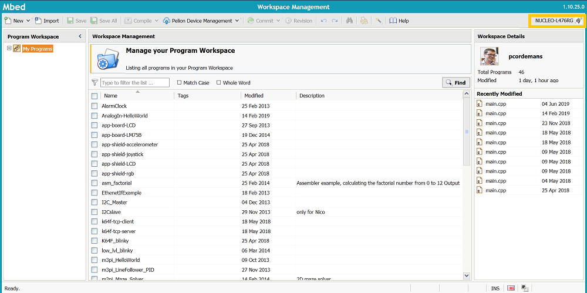
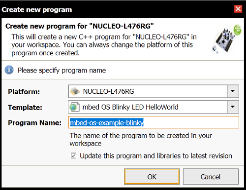

# Lab 1

## Goal

1. Run the mbed blinky example
1. Install the mbed-cli
1. Set up serial communication with the computer
1. Explore several peripherals 

## Mbed blinky

1. Register your account on [os.mbed.com](https://os.mbed.com/).
1. Log in and click on compiler in the upper right corner.
1. Select the Nucleo-L476RG as your platform, by clicking the select platorm button in the upper right corner. 
    
    

    Figure 1: Overview of the mbed compiler. Select the Nucleo-L476RG platform.

1. Create a new program. Select the *mbed OS Blinky LED HelloWorld* template.

    

1. Connect the USB connector of the Nucleo board to the pc. The board will appear as the NODE_L476RG flash drive.
1. Open *main.cpp*. Click compile. Download the *.bin* file on the NODE_L476RG flash drive. The serial communication led will flash red/yellow when the program is loaded.
1. The file *main.cpp* contains C++ code. Syntax and programming concepts are similar to C#. For example:

    ```cpp
    #include "mbed.h"
    #include "platform/mbed_thread.h"


    // Blinking rate in milliseconds
    #define BLINKING_RATE_MS 500


    int main()
    {
        // Initialise the digital pin LED1 as an output
        DigitalOut led(LED1);

        while (true) {
            led = !led;
            thread_sleep_for(BLINKING_RATE_MS);
        }
    }
    ```


## Mbed CLI

## Serial communication

## Explore peripherals


