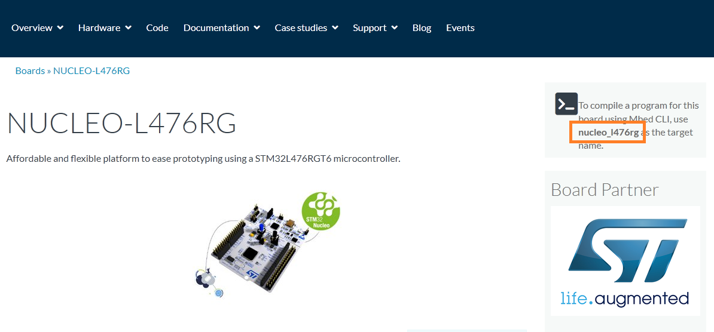
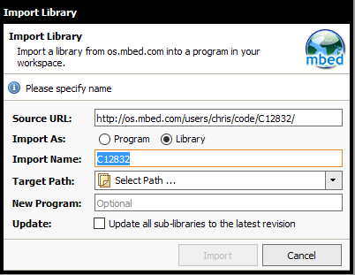

# Lab 1: The Hitchhiker's guide to the Mbed

## Goal

* Install the tools for host and Mbed development
* Run Hello World!
* Set up serial communication with the computer
* Explore several peripherals

## GCC and Make

1. Install gcc, g++ and make, choose your OS:
    1. On Windows:
        1. Enable the feature Windows Subsystem for Linux, open Powershell **as an Administrator**:

            ```bash
            Enable-WindowsOptionalFeature -Online -FeatureName Microsoft-Windows-Subsystem-Linux
            ```

        1. Restart when prompted
        1. Go to the Microsoft store, install Ubuntu
        1. Launch Ubuntu and follow the Ubuntu instructions
    ::: tip
    Windows Subsystem for Linux (WSL) is a lightweight Virtual Machine to run Linux (development) tools. It is not a complete Virtual Machine and is not intended for production purposes, like running an Apache webserver.

    While in the Microsoft Store, install the Windows Terminal app. This terminal allows you to run Powershell, WSL and CMD and provide a nice interface to these shells. Did you know [a terminal is not a shell](https://www.hanselman.com/blog/WhatsTheDifferenceBetweenAConsoleATerminalAndAShell.aspx)?

    More information on [WSL](https://www.hanselman.com/blog/CoolWSLWindowsSubsystemForLinuxTipsAndTricksYouOrIDidntKnowWerePossible.aspx) and [Windows Terminal](https://www.hanselman.com/blog/ItsTimeForYouToInstallWindowsTerminal.aspx).
    :::
    1. On Ubuntu:
        1. Update your package lists

            ```bash
            sudo apt-get update
            ```

        1. Install g++, this is the C++ compiler

            ```bash
            sudo apt-get install g++
            ```

        1. Install make, this is a build tool, which automates the build process

            ```bash
            sudo apt-get install make
            ```

1. Write a Hello World program in a file called **hello.cpp**.

    ```cpp
    #include <iostream>
    using namespace std;
    
    int main() 
    {

        cout << "Hello World! \n"; 
        return 0;
    }
    ```

1. Locate the file **hello.cpp** and run:

    ```bash
    g++ hello.cpp
    ```

    ::: tip
    If you are using WSL, your Windows file system can be found at ```/mnt```, for example: ```/mnt/c/```
    :::
1. Run the binary

    ```bash
    ./a.out
    ```

::: warning Assignment
Write a program which displays *Hello [insert your name here]!*
:::

## Mbed

### Git and Mercurial

1. Install [Git](https://software-installation-guide.netlify.app/git). Note that Git might already be installed.

    ```bash
    git --version

    ```

1. Install [Mercurial](https://www.mercurial-scm.org/). Mercurial is version management system like Git.

    ```bash
    hg --version

    ```

### GCC ARM Embedded

Install [GCC ARM Embedded](https://developer.arm.com/tools-and-software/open-source-software/developer-tools/gnu-toolchain/gnu-rm/downloads). **Don't forget to add GCC ARM Embedded to your path**

::: tip Add GCC ARM Embedded to your path
The tools have to be added to the PATH environment variable, so the commands become available in your CLI. At the end of the installer you can select to **Add path to environment variable.**

If you forget to select that option, you can still manually add the bin folder of GCC ARM Embedded to the PATH variable.


Figure 1: Change the PATH environment variable. 
:::

```bash
arm-none-eabi-g++ --version
```

### Conda

Install [Miniconda](https://docs.conda.io/en/latest/miniconda.html). Miniconda is a virtual environment manager for Python. Python virtual environments allow multiple versions of Python libraries and Python interpreters exist concurrently on a machine. It's a good idea to create a new virtual environment for each toolchain or Python project.

```bash
conda init powershell
conda --version
```

Create a new Conda environment with the Python 3.7.x interpreter and activate the environment

```bash
conda create -n mbed python=3.7
conda activate mbed
```

### Mbed CLI

Install Mbed CLI

```bash
python -m pip install mbed-cli
```

```bash
mbed --version
```

Use mbed config to set the global toolchain to GCC_ARM

```bash
mbed config --global toolchain GCC_ARM 
```

### Mbed Hello World

Create a new Hello World Mbed program in an empty folder which is not a subfolder of a git repository.

```bash
mbed new lab1
```

::: danger
```mbed new``` creates a git repository. It's not a good idea to create git repositories in other git repositories.
:::

Create a **main.cpp** file in the project.

```cpp
// This is main.cpp
#include "mbed.h"
#include "platform/mbed_thread.h"

// Blinking rate in milliseconds
#define BLINKING_RATE_MS 500

int main()
{
    // Initialize the digital pin LED1 as an output
    DigitalOut led(LED1);
    
    while (true)
    {
        led = !led;
        thread_sleep_for(BLINKING_RATE_MS);
    }
}
```

Go to the [Nucleo-L476RG mbed website](https://os.mbed.com/platforms/ST-Nucleo-L476RG/) to discover the target name.



Figure 2: Find the target name on the platform website.

Set the NUCLEO_L476RG as the target on the project.

```bash
mbed config target NUCLEO_L476RG 
```

Compile and flash the microcontroller.

```bash
mbed compile --flash
```

::: tip
If your board is plugged in the **--flash** flag will automagically copy the *.bin* file to the board. If you did not include this flag, you will have to manually copy the *.bin* file from the **./BUILD/NUCLEO_L476RG/GCC_ARM** folder.
:::

::: tip
Mbed provides an extensive library of classes with example code. One of these classes is the DigitalOut class to drive an output pin. Check out the documentation of the [DigitalOut class](https://os.mbed.com/docs/mbed-os/v5.15/apis/digitalout.html).
:::

::: warning Assignment
Write a program, which turns on the led for 3 seconds and turns it off for 1 second. Repeat this behavior 5 times.
:::
    
1. Check if the blinky led program is correctly loaded on your board.

### Mbed Serial communication

Set up serial communication between your PC and the Nucleo board.

Add the following code to print the mbed OS version:

```cpp
printf(
        "Mbed OS version %d.%d.%d\n",
        MBED_MAJOR_VERSION,
        MBED_MINOR_VERSION,
        MBED_PATCH_VERSION
    );
```

Compile and flash.

Use the builtin serial terminal to check the output.

```bash
mbed sterm
```

::: warning Assignment
Show Hello World! from the serial communication.
:::

::: tip Mbed OS6
Mbed OS6 does not have a Serial class. As an alternative you can use the [BufferedSerial](https://os.mbed.com/docs/mbed-os/v6.7/apis/serial-uart-apis.html) class. The BufferedSerial class does not offer a formatted print (printf), rather you can use the write method. The write method requires two parameters, a char array and the number of characters to be sent. An example:

```cpp
BufferedSerial pc(USBTX, USBRX);
pc.write("Hello World!\n", 13);
```
:::

::: tip Putty
An alternative to the mbed CLI builtin tool **sterm** is Putty. Download the [Putty](https://putty.org/) terminal application and run it.
Check on which COM port the mbed is registered:
```bash
    mbed detect
```

```text
    [mbed] Working path "C:\code\mbed\mbed-os-example-blinky" (program)

    [mbed] Detected NUCLEO_L476RG, **port COM3**, mounted D:, interface version 0221:
    [mbed] Supported toolchains for NUCLEO_L476RG
    | Target        | mbed OS 2 | mbed OS 5 |    uARM   |    IAR    |    ARM    |  GCC_ARM  | ARMC5 |
    |---------------|-----------|-----------|-----------|-----------|-----------|-----------|-------|
    | NUCLEO_L476RG | Supported | Supported | Supported | Supported | Supported | Supported |   -   |
    Supported targets: 1
    Supported toolchains: 4
```

In Putty: set up serial communication with Baudrate 9600 and the corresponding COM port.


Figure 3: Putty serial configuration, Baudrate 9600 and COM3 port selected.

Open the connection.

:::

## Explore peripherals

Add some peripherals with the [mbed Application Shield](https://os.mbed.com/components/mbed-Application-Shield/), import the example programs and finally combine these peripherals in a single program.

1. Libraries exist for all components on the mbed Application Shield. These classes are not included in the standard *mbed* library. Use the online compiler to import the RGB LED, LM75B Temperature sensor and the Joystick example programs. 
1. The libraries can also be imported with the *import library* into an existing program. This copies the necessary library files into the project directory. 
    
1. Libraries are included in code with an **#include** directive. For example to include the C12832 LCD display:
    ```cpp
    #include "C12832.h"
    ```
::: warning Assignment
Make a new program which allows the potentiometers to control the color of the RGB LED. Also, show the values of the potentiometers on the LCD display or in Putty.
:::

1. Programs can also be imported using the mbed cli. To import a specific version append with the version number:
    ```bash
    mbed import https://github.com/ARMmbed/mbed-os-example-blinky#mbed-os-5.11.0
    ```
1. Using the mbed cli, it is also possible to add libraries. For example:
    ```bash
    mbed add http://os.mbed.com/users/chris/code/C12832/
    ```

::: warning Assignment
Import your program from the mbed online compiler to your local machine using the mbed cli.
:::

:::tip
In order to import the program to the mbed cli you need to publish your project in the mbed repository. 

1. Commit the code, using the commit button in the online IDE.
1. Publish the project, using the down arrow next to the commit button. 
1. Go to the webpage of your published project, and click import with Mbed cli. Use the suggested command.
:::

## More information

1. [An introduction to Arm Mbed OS 5](https://os.mbed.com/docs/mbed-os/v5.15/introduction/index.html)
1. [Mbed Full API list](https://os.mbed.com/docs/mbed-os/v5.15/apis/index.html)
1. [Working with Mbed CLI](https://os.mbed.com/docs/mbed-os/v5.15/tools/working-with-mbed-cli.html)

## Extra

1. Use the x,y,z acceleration values of the accelerometer to control the color of the RGB LED.
1. Go to the lecturer and ask for the K64F board. Try to run your programs on the K64F board.
